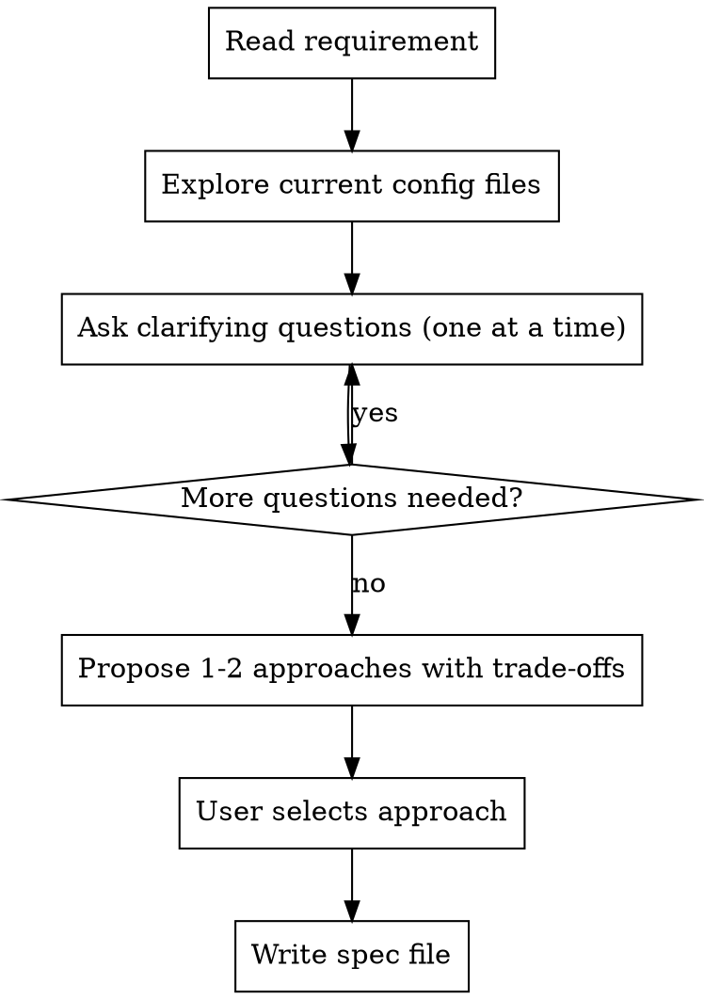

# Step 1: Brainstorm

**Input:** Feature requirement text from user.

**Goal:** Deeply understand the change, explore the current config, and produce a precise spec file that serves as the contract for planning.

**Output:** Spec file at `.claude/specs/YYYY-MM-DD-<feature>-spec.md`

---

### Process



### Codebase Exploration (REQUIRED)

Before asking questions, read the relevant config files:

1. **Affected files** — Which plugin specs, config modules will be touched
2. **Existing patterns** — How similar features are already configured
3. **Potential conflicts** — Keymaps already in use, plugins with overlapping features
4. **Plugin manager integration** — How the change fits into Lazy.nvim's loading

Read these as relevant:
- `lua/config/keymaps.lua` — for any keymap changes
- `lua/config/options.lua` — for any option changes
- `lua/plugins/lsp.lua` — for LSP server changes
- `lua/plugins/formatting.lua` — for formatter changes
- The specific plugin file(s) most affected

### Question Guidelines

- **One question at a time** — Don't overwhelm
- **Multiple choice preferred** — When possible
- **Conflict-focused questions** — Always ask about:
  - Does this conflict with any existing keymap?
  - Does an existing plugin already cover this need?
  - Should this be lazy-loaded and on what trigger?

### Spec File Structure

Save to: `.claude/specs/YYYY-MM-DD-<feature>-spec.md`

```markdown
# [Feature Name] Specification

## Summary

[One paragraph describing what this change does and why]

## Approach

[The selected approach and why it was chosen over alternatives]

## Changes Required

### Files to Modify

| File | What Changes |
| ---- | ------------ |
| `lua/plugins/...` | [description] |
| `lua/config/keymaps.lua` | [description, if any] |

### New Files (if any)

| File | Purpose |
| ---- | ------- |
| `lua/plugins/new-plugin.lua` | [description] |

## Functional Requirements

- [ ] [Specific behavior expected]
- [ ] [Specific behavior expected]

## Keymap Changes (if any)

| Key | Mode | Action | Conflict Check |
| --- | ---- | ------ | -------------- |
| `<leader>xx` | n | [action] | No conflict |

## Plugin Configuration Details

[Any specific plugin options, lazy-loading triggers, dependencies]

## Consistency Rules Checklist

- [ ] If adding LSP server: both `servers` table AND `ensure_installed` updated
- [ ] If adding formatter: both `formatters_by_ft` AND `ensure_installed` updated
- [ ] If changing colorscheme: both `colorscheme.lua` AND lualine theme in `ui.lua`
- [ ] If adding keymap: no conflict with existing keymaps in `keymaps.lua`

## Edge Cases & Failure Modes

[What could go wrong — plugin not found, missing dependency, keymap conflict]

## Out of Scope

[What this change explicitly does NOT include]
```
