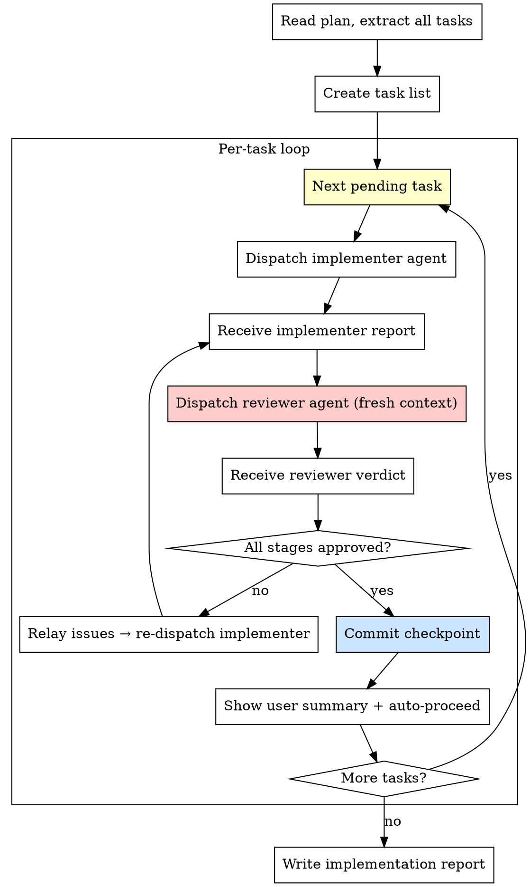

# Step 3: Implement

**Input:** Plan file path from plan step.

**Goal:** Execute the plan tasks using coordinated agents. Each task gets an implementer agent (makes the change, self-reviews) and a reviewer agent (fresh context, verifies the code). Coordinator commits after approval.

**Output:** Implementation report at `.claude/reports/YYYY-MM-DD-<feature>-report.md`

---

### Architecture: Thin Coordinator + Implementer + Fresh Reviewer

- The **coordinator** (you) holds only: plan content + task list. Per task: dispatch implementer → receive report → dispatch reviewer → receive verdict → commit → loop.
- The **implementer agent** starts fresh per task: reads the relevant files, makes the change, self-reviews, reports back. Does NOT commit.
- The **reviewer agent** starts with completely fresh context. Reads the actual changed files independently. Runs 2 review stages. Does NOT commit.
- The **coordinator commits** after reviewer approves.

### Process



### Two-Stage Review (Per Task — Reviewer Agent)

1. **Stage 1 — Spec Compliance** — Did it implement what was requested?
2. **Stage 2 — Code Quality** — Is the Lua clean and consistent with project conventions?

Order matters: Spec first, then quality. If Stage 1 fails, reviewer reports issues with `file:line` references. Coordinator relays to implementer for fixes, then re-dispatches a fresh reviewer.

### Dispatching Implementer Agents

Use `./implementer-agent-prompt.md` as the template. Fill in ALL placeholders:

| Placeholder | What to fill in |
|---|---|
| `[TASK_NUMBER]` | Task number from the plan |
| `[TASK_NAME]` | Task name from the plan |
| `[FULL_TASK_TEXT]` | **Paste the complete task text** from the plan — do NOT tell agent to read the plan file |
| `[CONTEXT]` | Where this fits, dependencies, related files already changed |
| `[PLAN_FILE_PATH]` | Path to the plan file |
| `[SPEC_FILE_PATH]` | Path to the spec file |

### Dispatching Reviewer Agents

Use `./reviewer-agent-prompt.md` as the template. Fill in ALL placeholders:

| Placeholder | What to fill in |
|---|---|
| `[TASK_NUMBER]` | Same task number |
| `[TASK_NAME]` | Same task name |
| `[ORIGINAL_TASK_TEXT]` | **Same full task text** pasted inline |
| `[IMPLEMENTER_REPORT]` | **Full text of implementer's report** — paste it inline |
| `[FILES_CHANGED]` | List of all changed files (from implementer report) |
| `[SPEC_FILE_PATH]` | Path to spec file |

### Commit Checkpoint (Coordinator, after reviewer approves)

After the reviewer returns APPROVED on all stages:

**Step 1: Stage and commit**
- Stage all task files
- Commit: `feat(<feature>): implement task N — <task name>`

**Step 2: Show user summary**
```
## Task N Complete: [task name]

**Files changed:** [list]
**Commit:** [hash] — [message]
**Progress:** N/M tasks done
**Next task:** Task N+1 — [name, or "done"]
```

**Step 3: Auto-proceed**
- Immediately dispatch the next implementer agent — do NOT wait for user approval
- Only pause for blockers, ambiguity, or errors

### Parallel Execution

- Identify tasks that are independent (no shared files)
- Dispatch independent tasks as **parallel implementer agents**
- **Never parallelize tasks that modify the same files**
- After all parallel implementers report back, dispatch parallel reviewer agents
- After all reviewers approve, commit each task individually

### Implementation Report

Save to: `.claude/reports/YYYY-MM-DD-<feature>-report.md`

**After writing, commit:** `docs(report): complete <feature> implementation report`

```markdown
# [Feature Name] Implementation Report

## Summary

[What was implemented]

## Spec Reference

[Path to spec file]

## Plan Reference

[Path to plan file]

## Tasks Completed

| # | Task | Status | Files Changed |
| - | ---- | ------ | ------------- |
| 1 | ...  | Done   | ...           |

## Review Results

### Spec Compliance

[Summary of spec review findings and resolutions]

### Code Quality

[Summary of quality review findings and resolutions]

## Known Issues / Technical Debt

[Any issues deferred or technical debt introduced]

## Files Changed

[Complete list of all files created/modified]

## How to Verify

[Steps to verify the feature works: open Neovim, run `:checkhealth`, test the specific keymap/command/plugin]
```
