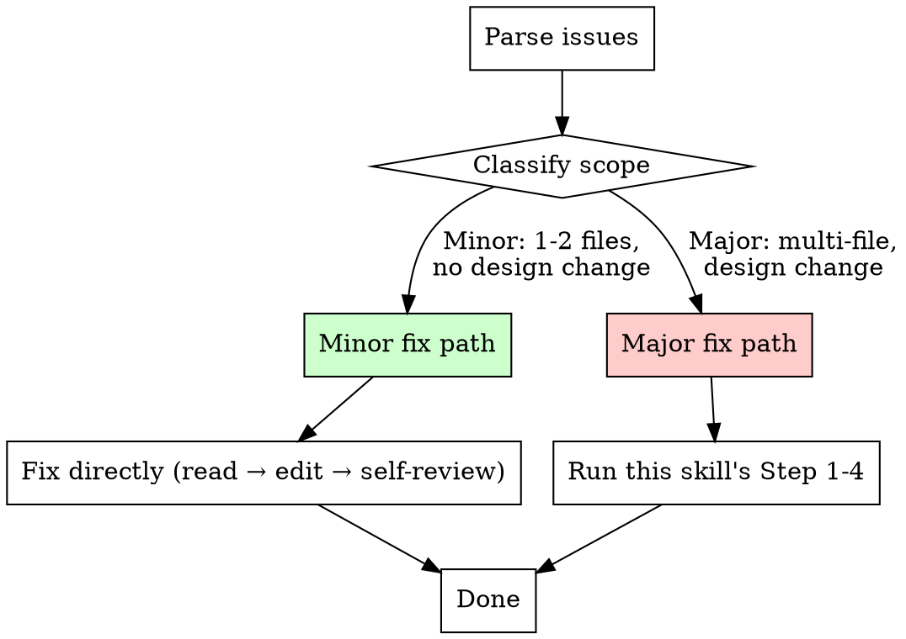

# Step 5: Fix

**Input:** Issue description (text) OR implementation report with issues.

**Goal:** Fix the identified problems using the appropriate path based on scope.

---

### Severity-Based Fix Path

### Minor Fix Path

Use when ALL of these are true:
- Fix touches **1-2 files** only
- No design change (not restructuring how plugins interact)
- No impact on other plugins or keymaps

**Process:**

1. Read the relevant source files
2. Fix the issue
3. Self-review: did the fix break anything? Any consistency rules violated?
4. Commit with a descriptive message

### Major Fix Path

Use when ANY of these are true:
- Fix touches **3+ files**
- Redesigns how something is structured
- Changes affect multiple plugins, keymaps, or config modules

**Process:**

1. Invoke this skill's **Step 1 (brainstorm)** with the fix as the requirement
2. Then **Step 2 (plan)** on the fix spec
3. Then **Step 3 (implement)** using the plan
4. Then **Step 4 (review)**
